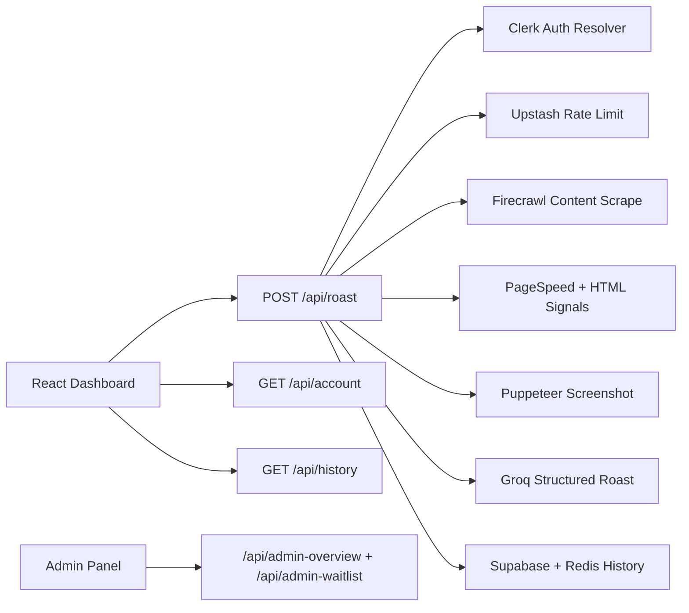

# RoastMySite

RoastMySite is a production-ready AI website critic platform.  
Users log in, paste a public URL, and receive a funny-but-actionable roast with quality metrics, proof chips, and prioritized fixes.

## Product Snapshot

- Login-required roasting flow with Clerk auth
- Free tier: 2 roasts/day (`#1 content + screenshot`, `#2 design + screenshot`)
- Pro tier: unlimited roasts (manual approval via waitlist)
- Persona-driven roast styles (`auto`, `assassin`, `kitchen`, `courtroom`, `sports`)
- AI output bundle: roast text + quality/severity scores + evidence + top fixes
- Admin APIs for usage analytics, waitlist approvals, and key health

## Tech Stack

- Frontend: React 18, TypeScript, Vite, Tailwind CSS, Framer Motion
- Backend: Vercel serverless functions (`api/*.ts`)
- AI: Groq (`groq-sdk`)
- Content analysis: Firecrawl
- Performance analysis: Google PageSpeed Insights + custom signal extraction
- Screenshots: Puppeteer Core + `@sparticuz/chromium`
- Auth: Clerk (`@clerk/clerk-react`, `@clerk/backend`)
- Rate limit + counters: Upstash Redis
- Persistence: Supabase (`public.roast_generations`) with Redis fallback history

## Core Flow

1. User signs in with Clerk
2. User submits URL in dashboard
3. `POST /api/roast` resolves auth + tier + daily limit
4. Free flow by IST day usage:
   - Roast #1: content mode (Firecrawl + screenshot + analysis)
   - Roast #2: design mode (screenshot + analysis)
5. AI generates structured roast with persona style
6. Result is returned and saved to history
7. If free limit is exhausted, user is redirected to waitlist CTA

## Tiering and Limits

| Tier | Daily Limit | Access |
|---|---:|---|
| Anonymous | 0 | Login required |
| Free | 2 | Fixed sequence: content then design |
| Waitlist Pending | 0 | Blocked until approval |
| Pro | Unlimited | All modes + unlimited usage |

Reset policy: **midnight IST**, keyed by `Asia/Kolkata`.

## Architecture



## Project Structure

```text
roastmysite/
├── src/
│   ├── pages/            # Route-level pages (home, dashboard, auth, results)
│   ├── features/         # Domain modules (auth, landing, roast)
│   ├── shared/           # Reusable ui, lib helpers, shared types
│   ├── config/           # Client-side content/config (launch messaging)
│   ├── App.tsx
│   └── main.tsx
├── api/                  # Vercel serverless functions
├── docs/                 # Product, launch, workflow, QA docs
├── public/               # Static assets (og-image, favicon)
├── tests/                # Node test runner regression suite
├── vercel.json           # Vercel function/runtime config
└── package.json          # scripts + dependencies
```

## Prerequisites

- Node.js 20+ (recommended)
- npm 10+
- Clerk project (publishable + secret keys)
- Groq API key
- Firecrawl API key
- Optional but recommended: Upstash Redis, Supabase, PageSpeed API key

## Environment Variables

Copy `.env.example` to `.env`:

```bash
cp .env.example .env
```

| Variable | Required | Purpose |
|---|---|---|
| `VITE_APP_URL` | Yes | Frontend base URL for local app |
| `VITE_CLERK_PUBLISHABLE_KEY` | Yes | Clerk publishable key for React client |
| `NEXT_PUBLIC_CLERK_PUBLISHABLE_KEY` | Yes | Compatibility key used by UI libs |
| `CLERK_SECRET_KEY` | Yes | Server-side token verification + metadata updates |
| `CLERK_JWT_ISSUER` | Optional | Strict issuer validation for Clerk JWT |
| `ADMIN_EMAILS` | Optional | Comma-separated admin emails |
| `GROQ_API_KEY` | Yes | AI roast generation |
| `FIRECRAWL_API_KEY` | Yes | Content scraping + content signals |
| `PAGESPEED_API_KEY` | Optional | Improves reliability when PSI throttles |
| `UPSTASH_REDIS_REST_URL` | Recommended | Rate limits, counters, cache, fallback history |
| `UPSTASH_REDIS_REST_TOKEN` | Recommended | Upstash auth token |
| `SUPABASE_URL` | Optional | Persistent roast history backend |
| `SUPABASE_SERVICE_ROLE_KEY` | Optional | Server-side insert/read for `roast_generations` |
| `ROAST_V11_ENABLED` | Optional (`1`) | Enables structured persona roast pipeline |
| `PRO_TIER_ENABLED` | Optional (`1`) | Enables Pro waitlist/tier behavior |
| `GROQ_DAILY_LIMIT` | Optional (`14400`) | Admin dashboard capacity reference |
| `FIRECRAWL_DAILY_LIMIT` | Optional (`500`) | Admin dashboard capacity reference |

## Local Development

Install and run:

```bash
npm install
npm run dev
```

Useful commands:

```bash
npm run lint
npm run test
npm run build
npm run test:qa
```

## API Reference

### `POST /api/roast`

Main roast endpoint (auth required).

Request body:

```json
{
  "url": "https://example.com",
  "persona": "auto",
  "roastMode": "auto"
}
```

Response includes:

- `qualityScore`, `severityScore`, `roastScore` (compat)
- `metrics`, `metricsSource`
- `evidence[]`, `fixes[]`
- `userStatus`, `dailyLimit`, `usedToday`, `remaining`
- `roastMode`, `personaUsed`

### `GET /api/account`

Returns authenticated user tier + current usage snapshot.

### `POST /api/pro-waitlist`

Creates/updates waitlist request in Clerk metadata.

### `GET /api/history?limit=20`

Returns user roast history (Supabase first, Redis fallback).

### `POST /api/analyze`

Runs PageSpeed + custom signal extraction.

### `POST /api/screenshot`

Captures website screenshot (JPEG base64).

### Admin Endpoints (admin email only)

- `GET /api/admin-overview`
- `GET /api/admin-waitlist`
- `POST /api/admin-waitlist` (`approve`/`deny`)

## Waitlist and Pro Operations

Pro status is metadata-driven via Clerk `public_metadata`.

- Workflow and metadata contract: `docs/pro-workflow.md`
- Launch copy and messaging: `docs/launch-messaging.md`

## Persistence Model

- Roast records table: `public.roast_generations` in Supabase
- SQL schema: `docs/supabase-schema.sql`
- If Supabase is unavailable, history falls back to Redis list storage

## Testing and QA

Automated suite uses Node test runner and covers:

- URL validation + security guards
- IST-based rate-limit logic
- Clerk auth resolution + metadata status mapping
- Roast endpoint guard behavior (`401`, `403`, `429`)
- Account/history/waitlist endpoint behavior
- Analyze mode fallback (`pagespeed` vs `estimated`)

QA report:

- `docs/qa-report-2026-02-11.md`

## Deployment (Vercel)

Project is configured for Vercel serverless functions:

- `api/**/*.ts` memory: `1024`
- max duration: `30s`
- build command: `npm run build`
- output directory: `dist`

Deploy checklist:

1. Add all required env vars in Vercel project settings
2. Ensure Clerk production keys are configured
3. Verify Groq and Firecrawl keys are active
4. Verify Redis and Supabase credentials
5. Deploy and run smoke flow:
   - Login
   - Roast #1
   - Roast #2
   - Waitlist CTA
   - Pro approval path

## Security Notes

- Only public URLs are accepted; localhost/private IP ranges are blocked
- Auth is mandatory for roast execution
- Rotate keys immediately if exposed publicly
- Keep `CLERK_SECRET_KEY` and `SUPABASE_SERVICE_ROLE_KEY` server-only

## Troubleshooting

- `401 Unauthorized`: missing/invalid Clerk bearer token
- `429 Rate limit exceeded`: free daily cap reached
- `403 Waitlist pending`: user is pending Pro approval
- `FIRECRAWL_API_KEY is missing`: set Firecrawl key in env
- `Screenshot unavailable`: site timeout, blocked redirects, or browser env mismatch
- Frequent `estimated` metrics: add `PAGESPEED_API_KEY` and Redis cache

## License

Private project. All rights reserved.
